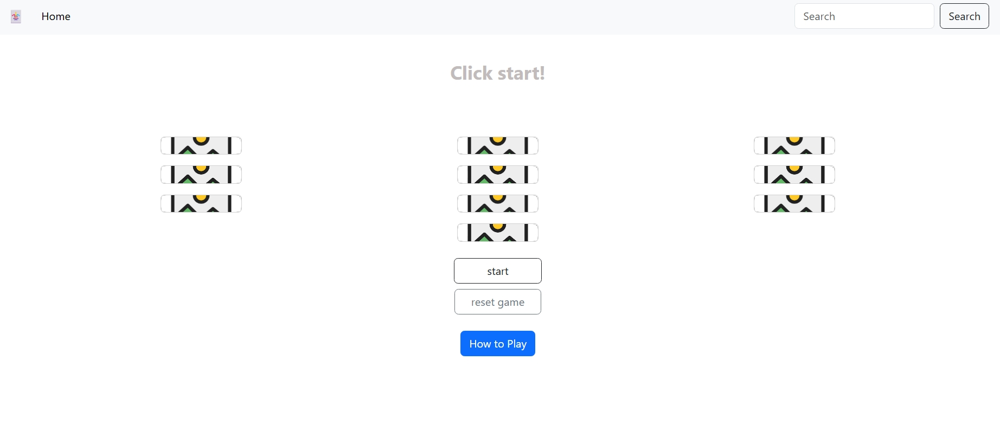

# 🧠 Memory Card Game

Memory Card Game is a fun and fast-paced browser game where players test their memory by matching pairs of hidden cards. You have limited time to find all the matching pairs — flip quickly and remember where cards are hidden before the clock runs out!

I chose this project because I enjoy simple brain-challenging games, and it was a great way to improve my JavaScript skills, especially with DOM manipulation, timers, and handling game state.

---

## 📸 Screenshot

> Make sure to place the `screenshot.jpeg` inside an `assets/` folder in your project root.

---

## 🚀 Getting Started

🔗 **Play the game:**  
[https://mnm622803.github.io/project1-memory-game/](https://mnm622803.github.io/project1-memory-game/)

📦 **To run locally:**
1. Clone or download this repository.
2. Open the `index.html` file in your browser.

---

## 🙏 Attributions

- Card images from open image resources
- Flip animation and layout inspired by CSS examples from [CSS Tricks](https://css-tricks.com/)
- UI layout inspired by Bootstrap's structure and components

---

## 💻 Technologies Used

- HTML
- CSS
- JavaScript
- Git & GitHub
- Bootstrap (for layout and buttons)

---

## 🌱 Future Enhancements

- Add sound effects when cards match or mismatch
- Show a win/lose modal popup at the end of the game
- Save high scores using `localStorage`
- Add different difficulty levels (easy, medium, hard)
- Make the layout fully responsive on mobile and tablet
